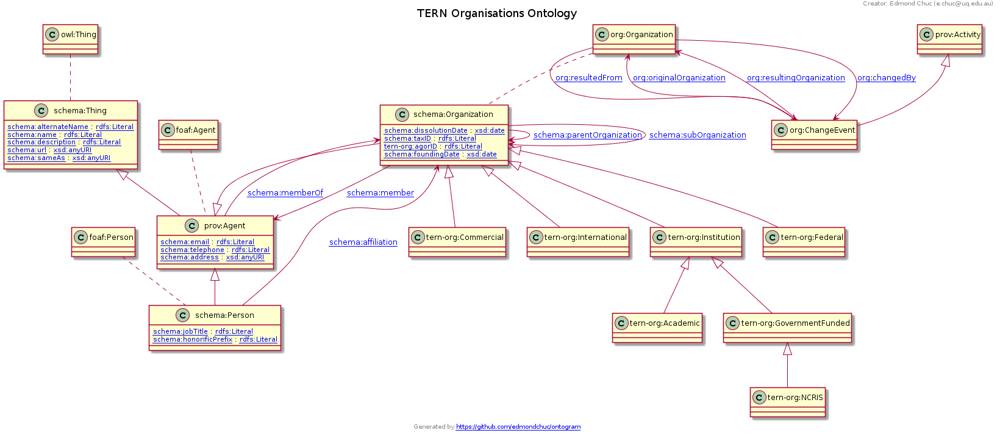

# Ontogram

Ontogram is an OWL ontology diagram generator.

Currently it supports `owl:class`, `rdfs:subClassOf`, `owl:equivalentClass`, datatype properties and domain and range relationships. I am planning to add support for `owl:subClassOf` restrictions soon. 


## Example output

The output of [examples/tern-org.ttl](examples/tern-org.ttl).




## Installation

Install via PyPI for Python 3.

```
pip3 install ontogram
```


## Usage

### Command line application

```
ontogram 
```


## Docker image for diagram generation within pyLODE

A Docker image has been created to automatically embed the generated diagram into a pyLODE document. See https://github.com/edmondchuc/docker-pylode

See the pyLODE output with the generated ontology diagram: https://w3id.org/tern/ontologies/org